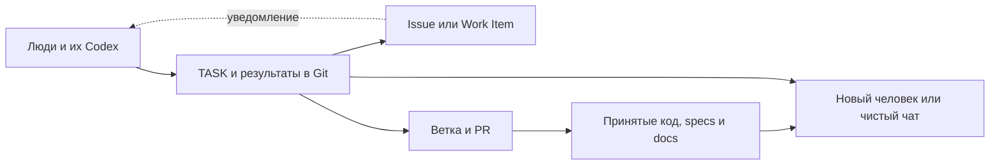
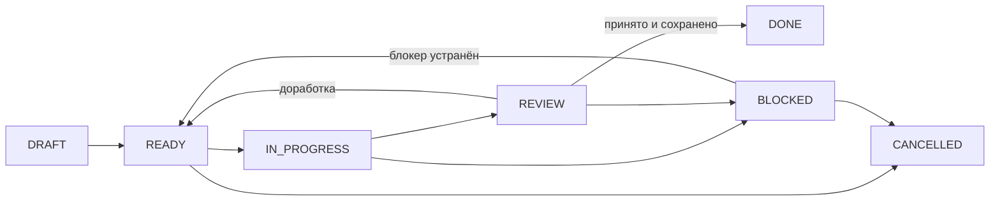
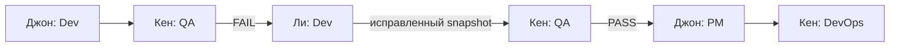
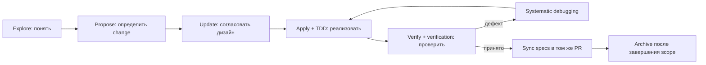
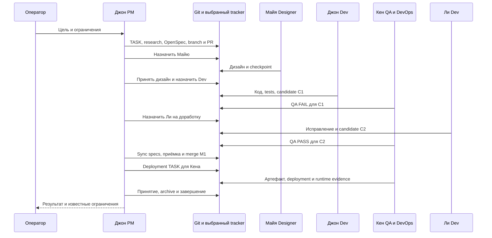
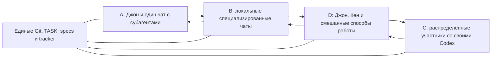

# R2Team 2.0

Git-first протокол для одного человека, нескольких Codex-чатов и распределённой команды.

R2Team — название протокола, ранее Codex Team Protocol. Версия `2.0`; существующие имена `CODEX_TEAM_PROTOCOL.md`, `CODEX_TEAM_SETUP.md` и поле `protocol_version` сохраняются для совместимости. Название не означает, что установлен skill или CLI-команда `r2team`.

**Статус документа:** протокол R2Team 2.0 для явного внедрения в проект. Этот файл сам по себе не меняет действующие проекты, настройки Codex или права участников. До отдельного перехода проект продолжает выполнять свой действующий протокол.

**Область:** GitHub с Git либо Azure DevOps Server/TFS с Git; участники со своими Codex; произвольное совмещение функций и использование внутренних субагентов.

При установке в проект этот документ сохраняется как `CODEX_TEAM_PROTOCOL.md`. Источник и точная редакция фиксируются в `TEAM.md`. Для поставки проверьте реальный commit релиза v2.0; наличие текста не означает установленных skills, CLI или работающего планировщика.

## Содержание

1. [Предпосылки и цель](#premises)
2. [Основания и источники](#sources)
3. [Основные правила и источники истины](#authority)
4. [Минимальные требования для входа](#entry)
5. [Структура проекта и точка входа](#structure)
6. [Участники, исполнители и функции](#team)
7. [Контракт TASK и состояния](#task)
8. [Пошаговый рабочий процесс](#workflow)
9. [Параллельность, смена владельца и восстановление](#handoff)
10. [GitHub и TFS с Git: настройка и выполнение](#providers)
11. [Спецификация, решения и документация](#specs)
12. [Навыки OpenSpec и Superpowers](#skills)
13. [Автоматизация и минимальное участие оператора](#automation)
14. [Запуск нового проекта](#setup)
15. [Внедрение в существующий проект](#migration)
16. [Сквозной пример фичи](#feature-example)
17. [От одного человека к большой команде и обратно](#team-examples)
18. [Проверка готовности протокола в проекте](#validation)
19. [Короткие инструкции для начала работы](#start-prompts)

<a id="premises"></a>
## 1. Предпосылки и цель

### 1.1 Почему нужен этот протокол

Чаты имеют отдельный контекст. Исполнители меняются, локальные окружения пропадают, люди передают работу друг другу. Обсуждение в чате, зелёный CI или закрытый Issue сами по себе не дают новому участнику полного ответа: что нужно сделать, что уже принято, где результат и какой следующий шаг.

Проект может начинаться с одного Джона, который выполняет все функции через один Codex-чат. Позже появляются отдельные локальные чаты, Кен со своим Codex, дизайнер Майя и разработчик Ли. Протокол должен поддерживать такой рост и обратное сокращение без переустройства проекта.

### 1.2 Цель

Git содержит всю подтверждённую информацию, необходимую для продолжения работы:

- требования, ограничения, архитектуру и существенные решения;
- участников, выполняемые функции и границы полномочий;
- задачи, текущих владельцев, выполненное, оставшееся и блокировки;
- версии кода, результаты проверок, сведения о сборках и выкладках;
- понятный следующий шаг и ссылки на связанные объекты.

Полнота состояния означает восстановление **с последнего опубликованного checkpoint**. Она не означает сохранение каждого промежуточного действия, скрытых рассуждений модели, содержимого секретов или незапушенной работы.

### 1.3 Предпосылки применения

1. У проекта есть один канонический Git remote и выбранный трекер.
2. Один текущий исполнитель выполняет функцию PM и координирует проект.
3. Участники публикуют checkpoint перед передачей работы, блокировкой или плановой паузой.
4. Доступы и окружение можно восстановить по документации и внешним средствам управления доступом.
5. Автоматизация выполняет только разрешённые операции.
6. Полнота спецификации проверяется отдельно от наличия файлов OpenSpec.

Число людей, компьютеров, чатов и субагентов не является частью продуктовой архитектуры. Их можно менять независимо от требований и истории задач.

<a id="sources"></a>
## 2. Основания и источники

Протокол объединяет документированные возможности инструментов и практические инженерные подходы. Его конкретная схема TASK и распределения функций является нашим проектным соглашением, а не официальным стандартом OpenAI.

| Источник | Что используем | Граница применимости |
| --- | --- | --- |
| [Codex Worktrees](https://learn.chatgpt.com/docs/environments/git-worktrees) | Изолированные checkout для независимой параллельной работы | Worktree не синхронизирует знания людей автоматически |
| [Long-running work](https://learn.chatgpt.com/docs/long-running-work) | Явные результат, ограничения и готовность; независимые задачи в отдельных чатах | Контекст одного чата не является состоянием всей команды |
| [AGENTS.md](https://learn.chatgpt.com/docs/agent-configuration/agents-md) | Загружаемая точка входа и инструкции проекта | Длинная инструкция сама по себе не гарантирует выполнение |
| [Codex Subagents](https://learn.chatgpt.com/docs/agent-configuration/subagents) | Ограниченное делегирование и сбор результатов родителем | Параллельные записи требуют координации; субагенты расходуют дополнительные ресурсы |
| [Harness engineering](https://openai.com/index/harness-engineering/) | Знания и планы в репозитории, короткая карта AGENTS, проверяемые правила и автоматизация | Опыт конкретной команды; автономность зависит от инструментов и качества окружения |
| [OpenAI Symphony](https://github.com/openai/symphony) | Диспетчеризация из трекера, изоляция workspace, workflow в репозитории, доказательства работы | Пример архитектуры автоматизации; отдельный сервис не обязателен для нашего протокола |
| [GitHub: связь Issue и PR](https://docs.github.com/en/issues/tracking-your-work-with-issues/using-issues/linking-a-pull-request-to-an-issue) | Связанная рабочая очередь, изменения, review и интеграция | Issue и комментарии не заменяют Git-контракт задачи |
| [GitHub Notifications](https://docs.github.com/en/account-and-profile/managing-subscriptions-and-notifications-on-github/setting-up-notifications/about-notifications) и [Inbox](https://docs.github.com/en/account-and-profile/managing-subscriptions-and-notifications-on-github/viewing-and-triaging-notifications/managing-notifications-from-your-inbox) | Mentions, подписки и адресное чтение обновлений человеком | Уведомления привязаны к аккаунту, не к executor; прочитано не означает выполнено |
| [Azure DevOps: работа от Work Item](https://learn.microsoft.com/en-us/azure/devops/boards/backlogs/connect-work-items-to-git-dev-ops?view=azure-devops) | Связь Work Item, branch, commits, PR и builds | Возможности зависят от версии Server и процесса проекта |
| [Azure DevOps CLI](https://learn.microsoft.com/en-us/azure/devops/cli/?view=azure-devops) и [REST API](https://learn.microsoft.com/en-us/rest/api/azure/devops/?view=azure-devops-rest-7.1) | Выбор совместимого способа автоматизации | Облачный Azure DevOps CLI официально не поддерживает Server/TFS |
| [OpenSpec: Concepts](https://github.com/Fission-AI/OpenSpec/blob/main/docs/concepts.md) | Текущие specs, предлагаемые delta, requirements и scenarios | Не является организационным трекером или автоматическим доказательством корректности |
| [OpenSpec: существующие проекты](https://github.com/Fission-AI/OpenSpec/blob/main/docs/existing-projects.md) | Постепенное внедрение с изменяемой области | Delta-first не создаёт полную спецификацию старого проекта автоматически |
| [Superpowers](https://github.com/obra/superpowers) | Прояснение задачи, TDD, диагностика, review и проверка перед заявлением о завершении | Навыки не заменяют источники требований и сохранённое состояние |

Дополнительные свидетельства сообщества: [OpenAI Developer Forum](https://community.openai.com/t/multiple-codex-agents-in-different-branches/1358394), [Reddit: multiple agents and worktrees](https://www.reddit.com/r/codex/comments/1q3496o/how_are_you_using_multiple_agents_and_worktrees/), [Reddit: same-branch interference](https://www.reddit.com/r/codex/comments/1rtm331/how_can_i_work_on_multiple_threads_on_the_same/).

В проверенном обсуждении форума worktree решает проблему одновременной работы в разных ветках. Для Reddit подтверждены названия публикаций; комментарии при проверке были недоступны. Эти ссылки не являются доказательством единого консенсуса сообщества.

Практический вывод: небольшие самостоятельные задачи, изоляция изменений, знания в Git, review, фактические проверки и минимум дублирующих журналов. Обязательная длинная последовательность ролей для любой мелочи из источников не следует.

<a id="authority"></a>
## 3. Основные правила и источники истины

### 3.1 Обязательные правила

1. Подтверждённое состояние сохраняется через commit и push.
2. У одной task-ветки один текущий владелец публикации изменений.
3. Передача работы меняет владельца TASK, а не создаёт новую задачу только ради следующей функции.
4. Требования, роли и этапы задают полномочия; уведомление их не расширяет.
5. Результаты проверок относятся к конкретному предмету проверки и версии.
6. Код, затронутые specs и документация согласуются перед интеграцией.
7. Новая сущность создаётся только при самостоятельной цели, владении, проверке или жизненном цикле.
8. Перед выполнением роль даёт человеку короткий бриф; при необходимости его действия сопровождает до проверенного результата или явной остановки.
9. Уточнения и обсуждения идут в связанном Issue/Work Item либо PR; существенные открытые вопросы и принятые ответы сохраняются в Git до зависимой работы, передачи и паузы.

### 3.2 Где находится истина

| Информация | Каноническое место | Кто изменяет |
| --- | --- | --- |
| Протокол, состав команды, текущий PM, правила функций | Принятые `CODEX_TEAM_PROTOCOL.md` и `TEAM.md` в основной ветке | PM через согласованное изменение |
| Scope, acceptance, текущий owner, checkpoint | `Tasks/TASK-*.md` на актуальной task-ветке | Владелец; scope и назначения — PM или явно уполномоченный исполнитель |
| Открытые вопросы, действия человека, существенные варианты и ожидаемые ответы | Current checkpoint / Decisions того же TASK | Один текущий владелец публикации; остальные предлагают через обсуждение |
| Принятый продуктовый контракт | `openspec/specs/` в основной ветке | Через принятую задачу и PR |
| Предлагаемое изменение | `openspec/changes/<change-id>/` в task-ветке | Назначенный исполнитель в пределах принятого scope |
| Код и незавершённые результаты | Task-ветка | Текущий владелец и его ограниченные помощники |
| Долгоживущие решения и документация | Связанные документы в Git | Исполнитель затронутой области; принятие по правилам задачи |
| Очередь, назначения людям, уведомления | GitHub Issue / Azure DevOps Work Item | Отображение состояния TASK |
| Diff, review, checks, merge | PR выбранного provider | По проектным правилам; существенные решения и результаты фиксируются в Git |
| Реальные thread ID и локальные маршруты | Ignored `.codex-local/THREAD_REGISTRY.md` | На соответствующей машине |
| Секреты, рабочие БД, большие артефакты | Их штатные защищённые хранилища | В Git — инструкции доступа, ссылки, версии и digest, когда применимо |

Актуальный `TEAM.md` читается из принятой основной ветки. Старая копия TEAM в давно созданной feature-ветке не даёт права игнорировать новое назначение или отключение участника.

### 3.3 Git и трекер

Один проект использует одну рабочую очередь: GitHub с Git либо Azure DevOps Server/TFS с Git. Git — система контроля версий; сам по себе он не предоставляет Issue/Work Item и PR-интерфейс.

Если tracker status или assignee расходится с опубликованным TASK, результат проверки — `SYNC_REQUIRED`. Исправляется отображение в трекере. Изменение требований, предложенное в комментарии, сначала принимается и записывается в Git.

В чате можно обсуждать варианты и наблюдать работу. Подтверждённые требования, решения, blockers и результаты должны перейти в TASK, specs или документацию до продолжения зависимой работы.

Комментарии Issue/PR и inbox не входят в `git clone`. Для восстановления с опубликованного checkpoint в Git нужны также незакрытые обращения: кому адресованы, что требуется, что блокируется, существенные варианты/ограничения и следующий шаг. Полная стенограмма остаётся в provider; отдельный архив MSG не требуется. Новый комментарий, ещё не отражённый в checkpoint, нельзя выдавать за уже сохранённое Git-состояние.

### 3.4 Что именно можно восстановить

`main` содержит принятую базу. Опубликованные task-ветки содержат текущее незавершённое состояние. Резервная копия только `main` недостаточна для восстановления активных задач.

Перед завершением работы должны быть доступны: TASK, результаты, используемые спецификации, точные refs, команды проверки, blockers и следующий шаг. Ссылки на CI или артефакты дополняются существенным итогом в Git, поскольку внешние логи могут истечь.



<a id="entry"></a>
## 4. Минимальные требования для входа

### 4.1 Для проекта

| Требование | Минимум |
| --- | --- |
| Владелец процесса | Один человек и один executor с функцией PM |
| Репозиторий | Доступный Git remote с начальным commit и выбранной основной веткой |
| Трекер | GitHub Issues/PR либо Azure DevOps Work Items/PR с Git-репозиторием |
| Инструкции | Этот протокол, короткий AGENTS, TEAM и команда первого запуска/проверки |
| Навыки | Доступные в нужных Codex навыки OpenSpec и Superpowers по разделу 12 |
| Сохранение работы | Возможность публиковать ветку и документы, открывать PR |
| Приёмка | Понятные критерии результата и хотя бы одна применимая проверка |

Отдельные Designer, Brain, Dev, QA, DevOps, COO, scheduler, общий сервер агентов или обязательный heartbeat для начала не нужны.

### 4.2 Для нового участника

Участник должен:

1. иметь доступ к нужному Git и tracker;
2. получить от PM запись участника, executor ID и разрешённые функции;
3. иметь Codex или совместимый способ выполнения инструкций и фактические инструменты своей задачи;
4. прочитать AGENTS, TEAM, текущий TASK и указанные материалы;
5. проверить возможность получить код, выполнить назначенные проверки и опубликовать результат;
6. знать, где запросить недостающий доступ или решение.

Для read-only исследования не требуется доступ к production. Для разработки не нужен deploy-доступ. Права определяются назначенной работой.

### 4.3 Проверка инструментов

Базовые проверки выполняет Codex и сохраняет краткий результат в setup-задаче:

```text
git --version
openspec --version
```

Для GitHub дополнительно проверяется установленный способ работы, например `gh auth status`. Для TFS проверяется разрешённый read-only REST-запрос с нужной версией API и Git-доступ.

Установка CLI, наличие навыков и наличие проектной папки `openspec/` — три разные проверки. Отсутствующий навык нельзя объявлять применённым.

Версии CLI и источники навыков фиксируются в TEAM. Для новой установки выбирается конкретная поддерживаемая версия; дальнейший запуск не должен молча зависеть от меняющегося `latest`.

<a id="structure"></a>
## 5. Структура проекта и точка входа

### 5.1 Структура без лишних каталогов

```text
AGENTS.md
CODEX_TEAM_PROTOCOL.md
TEAM.md
Tasks/
  TASK-001-short-name.md
openspec/
  config.yaml
  specs/
  changes/
docs/
  README.md
  architecture.md
  runbook.md
  R-001-short-research.md
  D-001-short-design.md
  ADR-001-short-decision.md
.codex-local/                    # ignored
  THREAD_REGISTRY.md
```

`openspec/` создаётся штатным OpenSpec CLI. Документы в `docs/` и локальный реестр создаются по мере необходимости. Существующие `Researches/`, архитектурные документы, runbooks и каталоги сохраняются на прежних путях, если они уже удобны; дубли не создаются.

Минимум на старте: AGENTS, протокол, TEAM и одна TASK. Если работа меняет продуктовый контракт, к этому добавляется соответствующий OpenSpec change. Если проект ещё не имеет спецификации, это явно отмечается в обзоре возможностей.

### 5.2 Короткий AGENTS

Пример содержимого файла; реальный проект дополняет его своими командами и ограничениями:

```markdown
# Работа в проекте

1. Прочитай CODEX_TEAM_PROTOCOL.md и актуальный TEAM.md.
2. Найди назначенный TASK на опубликованной task-ветке.
3. Проверь owner_executor_id, active_role, revision и полномочия.
4. Прочитай только связанные требования, план и необходимые документы.
5. До выполнения покажи короткое резюме принятой задачи.
6. Публикуй checkpoint перед handoff, блокировкой и плановой паузой.
7. Один текущий executor публикует изменения одной task-ветки.
8. Применяй нужные навыки OpenSpec и Superpowers.
9. Подтверждай результат фактическими проверками.
10. Сохраняй существенные решения и результаты в Git.

Команды запуска и проверки: см. docs/runbook.md.
Роли и маршруты ответственности: см. TEAM.md.
```

AGENTS является картой. История проекта, полный протокол и все требования в него не копируются.

### 5.3 Что не является обязательным

Не требуются отдельные MSG-файлы, MESSAGES.md, ролевые REPORT, журнал COO, курсоры COO или ручной дубликат статусов.

`PROJECT_STATE.md` допустим как генерируемый обзор. Он не становится отдельным источником истины и не требует отдельного PR при каждом изменении задачи.

Отдельные `ROLE-*.md` допустимы, если инструкции функции действительно длинные. Короткие обязанности помещаются в TEAM со ссылками на нужные документы.

<a id="team"></a>
## 6. Участники, исполнители и функции

### 6.1 Три понятия

| Понятие | Назначение | Пример |
| --- | --- | --- |
| Участник | Ответственный человек и его аккаунт в tracker | Джон, Кен |
| Исполнитель — executor | Устойчивое логическое имя рабочего чата, способного принять TASK | `john-main`, `ken-main`, `ken-qa` |
| Функция — role | Качество, в котором executor выполняет текущую работу | PM, Brain, Designer, Dev, QA, DevOps |

Один человек может иметь несколько executor-чатов. Один executor может выполнять несколько функций. Несколько участников могут иметь одну и ту же функцию.

PM — единственная обязательная функция. Один текущий `pm_executor_id` является координатором. Он может выполнять остальные функции сам, через свои субагенты или через других исполнителей.

### 6.2 TEAM: пример микрокоманды

Ниже полный пример организационного блока TEAM. Конфигурация provider добавляется из раздела 10.

```yaml
protocol_version: "2.0"
pm_executor_id: john-main
participants:
  - id: john
    tracker_actor: john-account
    active: true
    executors:
      - id: john-main
        active: true
        roles: [PM, Brain, Designer, Dev, QA, DevOps]
  - id: ken
    tracker_actor: ken-account
    active: true
    executors:
      - id: ken-main
        active: true
        roles: [QA, DevOps]
```

ID участника и ID executor уникальны в проекте. `tracker_actor` — проверенный идентификатор аккаунта выбранного provider, не секрет и не thread ID.

У каждого действующего TASK указан активный executor, а его `active_role` входит в разрешённый набор. Функцию PM выполняет только текущий `pm_executor_id`.

Ответственный человек определяется через executor в TEAM. Его не нужно дублировать в TASK. Один аккаунт Кена может получать назначения обеих функций: точный executor и функция указаны в Git TASK.

### 6.3 Стандартные функции

| Функция | Ответственность | Результат | Граница |
| --- | --- | --- | --- |
| PM | Цель, приоритет, scope, acceptance, распределение, принятие, состав команды | TASK, принятые решения, согласованные specs | Не объявляет непроверенное проверенным |
| Brain | Исследование, альтернативы, источники, unknowns | Короткое исследование или выводы в TASK | Не меняет продуктовый контракт самостоятельно |
| Designer | Пользовательские сценарии, состояния UI, взаимодействия, доступность | Дизайн и уточнения требований | Не внедряет неподтверждённый scope |
| Dev | Реализация, тесты, диагностика, технические документы | Код, тесты, checkpoints, evidence | Не выполняет чужую приёмку, merge или deploy без полномочий |
| QA | Проверка требований, сценариев и рисков на конкретном snapshot | Verdict, дефекты, воспроизведение, границы проверки | QA-only назначение не разрешает исправлять код |
| DevOps | Сборка, артефакты, окружения, БД/инфраструктура в scope, выкладка, rollback | Версии, digest, результат deployment и runtime evidence | Не расширяет среду или доступы вне назначения |

PM, Brain, Designer, Dev, QA и DevOps — классические базовые профили, а не закрытый список допустимых функций. PM может назначить или создать любую другую функцию: например Tester, Analyst, Architect, Security или Support.

Для новой функции PM фиксирует в Git устойчивое имя/ID, цель, ожидаемые результаты, границы и полномочия, применимые навыки, правила приёмки и допустимых субагентов. Короткий профиль хранится в TEAM; подробный — в отдельном ROLE-файле со ссылкой из TEAM. Затем функция включается в roles выбранного executor и может использоваться как active_role в TASK. Новый профиль не требует автоматически нового человека, чата, Issue или версии протокола.

Регистрация не завершает подключение: новая самостоятельная роль, включая новую функцию уже существующего чата, выполняет входной cross-check по разделу 14.6. Она сама сообщает, что поняла и что неясно, затем подтверждает уже назначенный TASK либо запрашивает первый у PM. Не требуется новый чат или отдельный отчёт только ради проверки.

Названия Tester и QA, Analyst и Brain не считаются автоматически синонимами: PM определяет их различия или явно объединяет обязанности. Разрешённый набор active_role определяется актуальной TEAM, а не фиксированным перечислением в скрипте. Название функции не расширяет права. Обязанности совмещённых функций сохраняются; единственный текущий координатор по-прежнему определяется pm_executor_id.

### 6.4 Субагенты любого исполнителя

Субагенты допустимы у Джона, Кена и любого другого участника.

Родитель:

1. задаёт ограниченный вопрос, пути и допустимые действия;
2. выбирает нужную функцию и навыки;
3. координирует пересекающиеся записи;
4. принимает и проверяет результат;
5. сохраняет итог в TASK и публикует checkpoint.

Субагент не получает отдельные Issue, PR и регистрацию только ради своего запуска. Он не меняет TEAM, владельцев TASK и внешние назначения и не отправляет межролевые уведомления вместо родителя.

Если работа помощника должна независимо назначаться, публиковаться и передаваться другим людям, PM оформляет самостоятельный TASK и, при необходимости, самостоятельного executor.

### 6.5 Варианты организации

| Вариант | Устройство | Что меняется в Git |
| --- | --- | --- |
| A | Джон, один `john-main`, нужные субагенты | Меняется `active_role` и checkpoint |
| B | Один человек, отдельные локальные специализированные или совмещённые чаты | Меняется `owner_executor_id` при handoff |
| C | Несколько людей со своими Codex и любым числом чатов | Те же назначения через TEAM и TASK |
| D | Любая комбинация A, B и C | Тот же контракт; отдельной версии процесса нет |

Локальность определяется относительно отправителя. Два чата Кена локальны друг для друга и могут быть удалёнными для Джона. Местоположение не зашивается в постоянные ID.

Физический чат можно заменить, сохранив логический executor ID и восстановив его из Git. Один executor ID не должен одновременно представлять два неконтролируемых активных владельца записи.

### 6.6 Независимость QA

Совмещение Dev, QA и DevOps разрешено. В evidence указывается, кто выполнил проверку и в каком качестве.

Смена названия функции или QA-субагент того же участника не доказывают независимую человеческую приёмку. Если требуется независимость, TASK определяет её уровень: другой executor либо другой участник. PM назначает проверяющего, который соответствует этому требованию.

<a id="task"></a>
## 7. Контракт TASK и состояния

### 7.1 Когда создаётся TASK

TASK создаётся для самостоятельной работы, которую нужно отдельно назначить, проверить или продолжить позже. Результатом могут быть код, исследование, дизайн, проверка или deployment.

Одна такая работа имеет четыре связанных объекта:

1. TASK-файл;
2. Issue или Work Item;
3. основную task-ветку;
4. основной PR.

Короткие внутренние подзадачи, субагенты и смена функций внутри этой работы не создают новые четыре объекта. Draft PR открывается после первого содержательного commit. Если provider не поддерживает draft, используется открытый PR с явным запретом интеграции до готовности.

### 7.2 Заголовок TASK

Пример GitHub-задачи. URL, ID и SHA в шаблонах заменяются фактическими значениями.

```yaml
---
protocol_version: "2.0"
id: TASK-042
revision: 1
status: READY
stage: IMPLEMENTATION
owner_executor_id: john-main
active_role: Dev
tracker_item: https://github.com/example/project/issues/42
branch: task/TASK-042-live-notifications
pr: https://github.com/example/project/pull/57
openspec_change: openspec/changes/live-notifications
base_sha: "<full-base-sha>"
candidate_sha: null
verified_sha: null
merged_sha: null
next_action: Implement the accepted notification scenarios
---
```

Обязательны: protocol_version, id, revision, status, stage, owner_executor_id, active_role, next_action. При передаче самостоятельному исполнителю также должны быть связаны tracker item, branch и PR.

OpenSpec-ссылка и SHA-поля заполняются по применимости. В DRAFT внешние ссылки могут отсутствовать, но такой TASK ещё не является готовым поручением.

`revision` увеличивается при изменении требований, acceptance или границ. Git commit SHA определяет версию всего состояния, включая назначения. Отдельный обязательный счётчик checkpoint не нужен.

`candidate_sha` — что нужно проверить; `verified_sha` — что действительно проверено; `merged_sha` — результат интеграции. Одно значение не подменяет другое.

### 7.3 Содержимое TASK

```markdown
## Outcome
Какой полезный результат требуется.

## Scope and boundaries
Что входит в задачу, что не входит, какие действия разрешены.

## Acceptance
Проверяемые критерии или точные ссылки на requirements/scenarios.
Требуемая независимость проверки, если она нужна.

## Plan
Ссылка на OpenSpec tasks.md либо короткие шаги для небольшой задачи.

## Current checkpoint
- Completed:
- Remaining:
- Blockers:
- Open requests, если есть: адресат-человек/executor, вопрос или действие, версия/среда, что блокирует, канал ответа.

## Evidence
- Предмет проверки и версия:
- Команда или сценарий:
- Фактический результат:
- Кто проверил:
- Ограничения, NOT_RUN, UNKNOWN:
- Ссылки на CI, артефакты, документы:

## Decisions and handoff
Короткие существенные решения и передачи: кто, кому, функция, причина.
Для обсуждения: требуемые позиции, существенные варианты/возражения, решение и кто уполномоченно принял его; unresolved не превращается в согласие.
```

`next_action` хранится один раз в заголовке. Детальный checklist не дублируется, если уже ведётся в OpenSpec `tasks.md`. Полная история остаётся в Git; текущий checkpoint должен читаться быстро.

### 7.4 Состояния

| Status | Значение |
| --- | --- |
| DRAFT | Контракт ещё формируется |
| READY | Исполнитель назначен, входные данные доступны |
| IN_PROGRESS | Работа начата текущим владельцем |
| REVIEW | Результат передан на проверку, принятие или интеграцию |
| BLOCKED | Следующий разрешённый шаг невозможен; указан blocker |
| DONE | Условия готовности выполнены, результат принят и сохранён |
| CANCELLED | PM прекратил работу, основание и остатки сохранены |

Stage показывает область работы: DISCOVERY, DESIGN, IMPLEMENTATION, QA, INTEGRATION, DEPLOYMENT. При необходимости проект уточняет названия без размножения почти одинаковых статусов.

Возврат после QA означает READY / IMPLEMENTATION с новым действием и владельцем. FAIL хранится в evidence. Если исправление можно выполнять, оно не должно ошибочно считаться BLOCKED.



Схема показывает типовой путь. Отмена возможна и с других незавершённых этапов по решению PM. Переход в DONE не заменяет фактические требования по merge или deployment, если они входят в Outcome.

<a id="workflow"></a>
## 8. Пошаговый рабочий процесс

### 8.1 Создать и подготовить работу

PM или уполномоченная им автоматизация:

1. Проверяет repository, remote, основную ветку и актуальную конфигурацию TEAM.
2. Определяет результат, необходимый этап и достаточно узкий scope.
3. Создаёт tracker item или связывает подходящий существующий.
4. Выделяет уникальный TASK ID, проверяя существующие назначения.
5. Создаёт task-ветку и изолированное рабочее окружение.
6. Записывает TASK, связанные материалы, owner и active role.
7. Делает первый содержательный commit и push.
8. Открывает PR, сохраняет его ссылку в TASK и публикует обновление.
9. Проверяет полноту входных данных, переводит TASK в READY.
10. Синхронизирует tracker assignee с участником, которому принадлежит executor, и уведомляет его.

Для внутреннего исследования PM может сам оставаться владельцем, менять active role и привлекать субагентов. Отдельная задача только ради каждого помощника не создаётся.

### 8.2 Получить задачу

Получатель:

1. Получает опубликованное состояние нужной ветки; широкое чтение всех задач не требуется.
2. Читает актуальный TEAM, проверяет своё назначение и активность.
3. Проверяет revision, scope, ссылки, expected commit и допустимый следующий шаг.
4. Если уведомление устарело, проверяет новое назначение в Git и не выполняет старое поручение автоматически.
5. Читает связанные specs, план, решения и необходимые документы.
6. До исполнения показывает человеку короткий бриф в своём чате: что и как проверяемо сделает, границы, ожидаемое участие человека и маршрут результата.
7. Фиксирует начало работы и начинает назначенный этап.

```text
Получено: TASK-042/2 · john-main → ken-main · функция QA.
Задача: проверить candidate <full-sha> по сценариям уведомлений.
Границы: QA only; без изменения кода, merge и deploy.
Результат: evidence и checkpoint TASK, уведомление john-main через tracker.
Начинаю.
```

Резюме занимает 3–5 строк, не копирует TASK и не заменяет scope. При неполном, неадресованном или противоречивом поручении выводится BLOCKED; blocker сохраняется в Git и возвращается через tracker. ACK-файл не создаётся.

Если участие человека ожидается, добавь одну короткую строку либо объедини её с результатом, сохранив 3–5 строк. Если неизвестно — так и скажи. Правило действует для PM, отдельных и совмещённых функций; за субагентов отвечает родитель. После изменения контракта или значимого нового действия кратко объясни изменение до его исполнения. Бриф не требует повторно согласовывать уже разрешённые технические шаги.

### 8.3 Выполнить этап

1. Применить подходящие навыки по разделу 12.
2. Работать небольшими проверяемыми изменениями.
3. Не изменять чужие результаты вне scope и не присваивать чужую работу.
4. Записывать существенные решения и обнаруженные ограничения.
5. Обновлять checkpoint на границах этапов, перед handoff, блокировкой и паузой.
6. Сохранить результаты и выполнить фактические проверки.
7. Записать выполненное, оставшееся и непроверенное.

Перед началом/возобновлением и на безопасных контрольных точках проверяй адресные обновления по разделу 13.6. При необходимости действия человека, уточнения или согласования используй цикл ниже; зависимый шаг не начинается по предположению о согласии.

Подтверждённый план, влияющий на последующее выполнение, сохраняется в TASK или OpenSpec. Рабочее рассуждение внутри чата не требуется превращать в отдельный документ.

### 8.4 Передать работу

1. Текущий владелец проверяет remote head и отсутствие новых конфликтующих изменений.
2. Сохраняет результаты, evidence и checkpoint.
3. По принятому маршруту либо решению PM назначает нового executor и active role.
4. Указывает следующий шаг и причину передачи.
5. Публикует commit и push без force.
6. Обновляет tracker и уведомляет следующего исполнителя.
7. После опубликованного назначения больше не пишет в task-ветку как прежний владелец.

Переход QA → DevOps внутри одного `ken-main` не требует внешнего handoff. Меняются функция, этап и checkpoint; отдельно проверяется разрешение на выкладку.

### 8.5 Проверить и принять

QA или назначенный проверяющий:

1. Фиксирует точный candidate SHA и контекст среды.
2. Проверяет acceptance, применимые OpenSpec scenarios и необходимые риски.
3. Выполняет требуемые команды и наблюдения.
4. Записывает PASS/FAIL/BLOCKED, фактическое покрытие и NOT_RUN.
5. При FAIL возвращает работу с воспроизведением и ожидаемым результатом.
6. При PASS передаёт результат PM либо назначенному принимающему.

Зелёный CI не заменяет непроведённую runtime-проверку или пользовательскую приёмку, если они требуются TASK.

### 8.6 Интегрировать

PM или разрешённая автоматизация:

1. Проверяет acceptance, evidence, обязательные reviews и checks.
2. Убеждается, что новые specs и затронутая документация входят в PR.
3. Проверяет применимость evidence к финальному diff и актуальной базе.
4. Разрешает и выполняет merge в пределах проектной политики.
5. Фиксирует фактический merged SHA и результат интеграции.
6. Закрывает TASK после выполнения его definition of done.

Commit только с QA-отчётом не заставляет повторять все тесты, если проверенный diff не меняет предмет проверки. Изменения кода, тестов, зависимостей, конфигурации или базы требуют соответствующей повторной проверки. `verified_sha` не переписывается значением `merged_sha` без основания.

Факт merge появляется после операции и не может честно ссылаться на себя внутри того же commit. Его сохраняют последующим коротким служебным commit/PR, по возможности вместе с оформлением deployment. Такой PR относится к существующим TASK и не требует новой бизнес-задачи. Записывается merge продуктового PR; бесконечная цепочка отчётов о merge отчётов не нужна.

### 8.7 Выполнить deployment

Для отдельно управляемого релиза создаётся deployment TASK. Автоматический preview/staging deployment в рамках текущего PR может оставаться его этапом.

DevOps:

1. Проверяет source SHA, целевую среду и разрешение на действие.
2. Определяет существующий артефакт либо выполняет воспроизводимую сборку.
3. Записывает digest артефакта и параметры среды без секретов.
4. Проверяет исходное состояние и доступный rollback.
5. Выполняет разрешённую выкладку, включая миграции БД только при наличии scope.
6. Проводит необходимые runtime-проверки.
7. Сохраняет результат, ограничения и следующий шаг.
8. Передаёт приёмку PM.

Сборка, установка, запуск и успешная работа целевой среды — разные факты. HTTP health check подтверждает только проверенный endpoint, а не всю функциональность.

<a id="interaction"></a>
### 8.8 Роль и человек: пошаговое сопровождение

Действие человека может потребоваться любой функции: настройка доступа, ввод секрета в защищённое хранилище, визуальная приёмка, продуктовый выбор. Это часть текущего TASK, а не автоматическое назначение человеку всей задачи.

1. Объясни, зачем нужно действие, кто его выполняет и почему роль не выполняет его сама.
2. Дай конкретный следующий шаг: целевая среда/экран, версия, безопасные входы, ожидаемый результат. Не выдавай предполагаемый интерфейс за проверенный.
3. Для сложной настройки веди по шагам: ответ человека → доступная проверка → следующий шаг. Не повторяй весь опрос и не оставляй человека с общим «настрой систему».
4. При ошибке объясни проверяемое исправление или диагностику в scope. Изменение прав, среды, расходов или разрушительное действие требует соответствующего разрешения.
5. Секрет вводится через штатный защищённый механизм, не в TASK, комментарий или чат. Запрашивай безопасное подтверждение/редактированный скриншот, а не credentials.
6. Сохрани, кто что подтвердил, для какой версии/среды и что проверила сама роль. Человеческая визуальная приёмка не называется автоматическим тестом; «готово» без необходимой проверки не становится PASS.
7. Продолжи задачу после снятия препятствия либо зафиксируй явную остановку: что осталось, у кого следующий ход, как возобновить. Сопровождение продолжается до закрытия задачи, согласованной передачи или остановки, но не обещает фоновую работу незапущенного Codex.

Ответ можно получить в чате участника или связанном Issue/PR. Существенный результат родитель/владелец публикует в Git и сообщает заинтересованным адресатам через provider. Действующее назначение не теряется. Если доступна независимая разрешённая часть, она продолжается; если следующий шаг невозможен — BLOCKED с конкретным ожиданием, без нового статуса HUMAN_WAIT.

### 8.9 Уточнение задачи между ролями и участниками

Общие вопросы по TASK обсуждаются в его Issue/Work Item. Вопрос к конкретному diff — в соответствующем review-thread PR. Один вопрос имеет один основной канал; в другом месте оставляется ссылка, не вторая независимая дискуссия.

Запрос содержит TASK/revision, автора и целевой executor/функцию либо человека, конкретную неопределённость, существенный контекст/вариант и влияние на продолжение. Укажи проверенный provider account адресата; не предполагай, что имя роли само уведомит человека.

Ответ даёт компетентная роль или человек в пределах своих полномочий. PM не пересылает каждый вопрос. Уточнение уже принятого контракта фиксируется без искусственного изменения revision. Изменение scope, acceptance или прав принимает PM/явно уполномоченный владелец; после принятия обновляются TASK revision и затронутые OpenSpec-артефакты до реализации. Сообщение с предложением само контракт не меняет.

До ответа останавливается зависимая часть. Незавершённый контракт остаётся DRAFT; обсуждение в разрешённом discovery scope возможно, но спорная реализация не начинается. Для уже выполняемой работы без доступного следующего шага — BLOCKED. Получение вопроса не меняет owner TASK. После ответа исполнитель сверяет актуальные правила и продолжает с сохранённого next_action.

### 8.10 Обсуждение и согласование до реализации

Для двух или нескольких ролей используй тот же TASK и Issue/Work Item, не создавай новую сущность ради каждого раунда. PM/текущий ответственный кратко задаёт предмет решения, варианты/критерии, требуемые позиции и того, кто вправе принять итог.

Каждая нужная роль даёт позицию: рекомендуемый вариант, проверяемые аргументы, риски и возражения. Один человек может совмещать функции; его разные чаты/субагенты не считаются независимыми человеческими голосами. Субагенты возвращают выводы родителю, который публикует существенное в общем обсуждении.

Ответственный сводит согласованное, оставшиеся возражения и предлагаемое решение. Молчание, отметка «прочитано», количество агентов или истёкшее время не являются согласием. При отсутствии консенсуса — решение уполномоченного PM/человека с основанием либо явная блокировка. Обязательные ограничения безопасности не отменяются голосованием.

Принятый итог сохраняется в TASK; требования/дизайн — в OpenSpec по изменённому контракту, долгосрочное архитектурное решение — в ADR при необходимости. Зафиксируй существенные отвергнутые варианты и причину, не всю стенограмму. До зависимой реализации получи необходимые согласования и опубликуй обновлённый контракт. Для неясного вопроса применимы OpenSpec explore и Superpowers brainstorming; изменение артефактов — через подходящий workflow с его gates, без второго параллельного плана.

### 8.11 Состояние обсуждения в Git без новых журналов

В Current checkpoint текущего TASK достаточно краткой записи для каждого ещё существенного обращения: адресат, требуемый ответ/действие, версия/среда при необходимости, что блокирует, ссылка на основной канал. В Decisions сохраняются итог, основание, принимающий и оставшиеся возражения. Пустые реестры, отдельные ACK, MSG и обязательные Q-ID не вводятся; ссылкой на обращение служит comment/review-thread URL.

Вопросы и ответы могут писать все уполномоченные участники, но TASK публикует один текущий владелец. Не-владелец оставляет комментарий; владелец отражает его существенное состояние до зависимой работы, передачи или плановой паузы. Никто не перезаписывает конкурентно общий TASK ради ответа.

При исходящем блокирующем запросе владелец сначала публикует checkpoint с адресатом и уже известным Issue/PR URL, затем адресный комментарий. Точный URL нового комментария можно добавить со следующим обычным checkpoint; второй немедленный commit только ради URL не требуется. Новые ответы не являются сохранённым Git-результатом до их включения в checkpoint. Локальное непубликованное состояние — LOCAL_ONLY, при недоступном уведомлении — NOT_DELIVERED/SYNC_REQUIRED, а не успешная передача.

<a id="handoff"></a>
## 9. Параллельность, смена владельца и восстановление

### 9.1 Один владелец публикации

У task-ветки один текущий executor с правом публикации. На разных машинах могут существовать её копии, но они не становятся независимыми владельцами.

Внутри одного Git-репозитория соблюдается ограничение checkout одной ветки в worktree. На разных машинах оно не обеспечивает распределённую блокировку. Корректность обеспечивается проверкой назначения, актуального remote head и запретом force-push; автоматизация может проверять эти условия перед публикацией.

Независимые одновременно публикуемые изменения получают отдельные TASK/ветки. Read-only проверки одного snapshot могут идти параллельно. Субагенты работают в ограниченных непересекающихся областях, а родитель контролирует публикацию.

### 9.2 Смена участника или функции

Смена исполнителя сохраняет TASK ID, основной PR, требования и историю. Меняются owner, функция, этап и следующий шаг.

Если scope не изменился, revision требований не увеличивается. Новая версия состояния определяется commit SHA.



Выбор другого человека для исправления — решение PM либо заранее разрешённый маршрут. QA-only исполнитель не превращается в разработчика автоматически.

### 9.3 Takeover при недоступном исполнителе

1. PM получает последний опубликованный remote head.
2. Проверяет TASK, результаты и возможность получить checkpoint прежнего владельца.
3. Сохраняет причину takeover, известные ограничения и нового владельца.
4. Неполученная незапушенная работа помечается UNKNOWN.
5. Новый владелец подтверждает вход и начинает с опубликованного состояния.
6. Возобновившийся прежний владелец сначала перечитывает назначение.

Поздно найденные изменения прежнего владельца передаются отдельной salvage-веткой или патчем. Они не перезаписывают новую историю.

### 9.4 Чистый чат или новый компьютер

1. Клонировать правильный remote или открыть проверенный clone.
2. Получить основную ветку и нужную task-ветку.
3. Прочитать AGENTS, принятый TEAM и протокол назначенной версии.
4. Прочитать TASK на текущем remote head.
5. Проверить owner, active role, scope, plan, blockers и evidence.
6. Восстановить окружение по runbook и получить доступы штатным способом.
7. Показать intake summary и продолжить с next_action.

Новая машина не наследует секреты, локальные процессы и результаты проверок другой среды автоматически.

### 9.5 Отключение участника

Для взаимодействия самостоятельных проектов см. [MULTI_REPO.md](MULTI_REPO.md): один владелец SDK/API-контракта, repo-qualified TASK, связанные PR и подтверждения потребителей. В каждом репозитории сохраняются собственные PM, права и единственный публикующий владелец задачи; общий обязательный PM/сервис не вводится.

PM переназначает незавершённые TASK, помечает неиспользуемые participant/executor записи как `active: false` и отключает локальные маршруты. Реальные доступы отзываются по принятому порядку.

Исторические ID, коммиты и evidence сохраняются. Отключение executor с оставшимися активными назначениями требует явного решения о передаче или блокировке этих задач.

<a id="providers"></a>
## 10. GitHub и TFS с Git: настройка и выполнение

### 10.1 Общая модель

| Потребность | GitHub с Git | Azure DevOps Server/TFS с Git |
| --- | --- | --- |
| Репозиторий | GitHub repository | Azure Repos Git repository |
| Рабочая очередь | Issue | Work Item выбранного типа |
| Назначение человеку | Assignee | Assigned To |
| Исполнитель и функция | TASK в Git | TASK в Git |
| Обсуждение | Issue/PR comments | Work Item history/comments, PR threads |
| Изменения | Branch и Pull Request | Branch и Pull Request |
| Проверки | Actions/checks/statuses | Build pipelines и branch policies |
| Автоматизация | `gh` или REST API, доступные интеграции | Совместимый REST API/клиентская библиотека |
| Доступ | Штатная GitHub-аутентификация | Git credentials, серверная аутентификация; VPN при необходимости |

GitHub и TFS не запускают чужой Codex просто из-за назначения задачи. Получатель открывает её сам или настраивает свою автоматизацию. Требования к Git-состоянию одинаковы.

### 10.2 Настройка GitHub

Блок TEAM:

```yaml
tracker:
  provider: github
  repository: example/project
  repository_url: https://github.com/example/project
  default_branch: main
```

При setup:

1. Проверить remote и права участников.
2. Проверить Issue и PR-доступ выбранным инструментом.
3. Определить основную ветку и обязательные checks/review.
4. Зарегистрировать действительные accounts в tracker_actor.
5. Согласовать разрешённые создание Issue/веток/PR, push и merge.
6. Проверить один небольшой полный цикл.

Примеры реальных инструментов; body-файлы предварительно формирует Codex из TASK:

```text
gh issue create --repo example/project --title "TASK-042: live notifications" --body-file issue-body.md
gh pr create --repo example/project --draft --base main --head task/TASK-042-live-notifications --title "TASK-042: live notifications" --body-file pr-body.md
```

Команды показывают способ выполнения, а не выдают разрешение выполнить их в любом репозитории. В рабочем проекте используются проверенные URL, branches и настройки.

### 10.3 Пошаговая работа GitHub

1. PM/Codex создаёт Issue и сохраняет возвращённый URL.
2. Создаёт TASK, branch, первый commit и push.
3. Открывает Draft PR, связывает объекты, публикует TASK с точными ссылками.
4. Назначает assignee участнику из TEAM; executor и role остаются в TASK.
5. Исполнитель получает ветку, работает и публикует checkpoints.
6. При handoff меняются TASK owner и assignee, добавляется comment с commit-pinned ссылкой.
7. QA сохраняет evidence в Git и при необходимости оставляет PR review.
8. PM проверяет фактические checks нужного SHA и принимает merge.
9. После фиксации результата закрывается Issue согласно его definition of done.

`Closes/Fixes #...` используется в PR только если merge действительно должен закрыть Issue. Если Outcome требует дальнейшего deployment, преждевременное автозакрытие не настраивается.

### 10.4 Настройка Azure DevOps Server/TFS с Git

Блок TEAM; placeholders заменяются проверенными значениями:

```yaml
tracker:
  provider: azure_devops_server
  collection_url: https://tfs.example.test/tfs/DefaultCollection
  project: SampleProject
  repository_id: "<repository-id>"
  repository_url: https://tfs.example.test/tfs/DefaultCollection/SampleProject/_git/SampleRepo
  default_branch: main
  api_version: "<supported-api-version>"
  work_item_type: Task
```

При setup:

1. Убедиться, что repository использует Git. TFVC требует отдельной миграции или другого протокола.
2. Проверить collection, project, repository ID и фактическую основную ветку.
3. Определить версию Server и совместимую версию REST API.
4. Проверить доступ Git и read-only API без вывода секретов.
5. Проверить типы Work Item, допустимые состояния и identity участников.
6. Определить branch policies, pipelines и доступность draft PR.
7. Проверить связанный Work Item → branch → PR → build на небольшой задаче.

Azure DevOps Services и локальный Server — разные цели автоматизации. `az devops` не считается поддерживаемым способом для Server/TFS. Используются совместимые REST API или клиентские библиотеки.

Пароли, PAT и credential blobs не помещаются в URL, TEAM, TASK, команды-примеры и логи. Документируется способ получить доступ, а не секрет.

### 10.5 Пошаговая работа TFS

1. PM/Codex создаёт Work Item разрешённого типа либо использует существующий.
2. Сохраняет ID/URL и создаёт TASK в обычной Git-ветке.
3. Делает commit/push штатным Git.
4. Создаёт PR с source `refs/heads/task/...` и target `refs/heads/main`.
5. Связывает Work Item, PR и TASK штатными ссылками development-объектов.
6. Заполняет Assigned To проверенной identity участника; executor и active role сохраняются в TASK.
7. Исполнитель публикует checkpoints; при handoff обновляются TASK, Assigned To и уведомление.
8. QA сопоставляет evidence и build results с нужной версией.
9. PM выполняет требуемые branch policies и принимает PR.
10. Work Item переходит в предусмотренное процессом конечное состояние после выполнения definition of done.

Если версия Server не поддерживает draft PR, создаётся обычный PR с явно неготовым состоянием работы и действующими ограничениями на merge.

### 10.6 Что реализует адаптер Server/TFS

Ориентиры REST API, а не готовые команды для неизвестного сервера:

| Операция | Семейство ресурса |
| --- | --- |
| Создать Work Item типа Task | `POST {collection}/{project}/_apis/wit/workitems/$Task?api-version={version}` |
| Изменить назначение/состояние | `PATCH .../_apis/wit/workitems/{id}?api-version={version}` |
| Создать или проверить PR | `.../_apis/git/repositories/{repositoryId}/pullrequests` |
| Оставить PR-обсуждение | `.../pullrequests/{pullRequestId}/threads` |
| Прочитать builds | `.../_apis/build/builds` |

`$Task` — пример сегмента для типа Task; фактический тип должен существовать на сервере. Это буквальный фрагмент URL, не команда или переменная shell. Для другого типа строится корректно кодированный сегмент.

Work Item update использует поддерживаемый JSON Patch и реальные поля процесса, например `System.AssignedTo` и `System.State`. Имена состояний и формат identity проверяются на конкретном сервере. Способ комментариев и draft-возможности тоже проверяются по версии.

TASK status не копируется слепо в System.State: в TEAM или небольшом скрипте задаётся соответствие проектному процессу. REVIEW может отображаться существующим Active с пояснением; нельзя выдумывать отсутствующее серверное состояние.

### 10.7 Общие правила синхронизации

- Внешний item/PR создаётся один раз; возвращённые идентификаторы сохраняются.
- После неопределённого ответа сначала проверяется наличие объекта по точным данным. Повторное создание без проверки запрещено.
- Handoff считается сохранённым после успешного push; готовность доставки проверяется отдельно.
- При недоступном tracker Git checkpoint сохраняется, а ошибка доставки отражается честно.
- Применимость checks проверяется по commit/build metadata, а не только по зелёному цвету.
- Смена provider не требуется для подключения нового человека или нового Codex.

### 10.8 Профиль TFS с CMMI

Единый setup может выбрать процесс CMMI и две цепочки:

- Requirement → Task → PR для самостоятельной работы;
- Requirement → Bug → PR для самостоятельного исправления.

Requirement — родительский Work Item. Task/Bug — дочерний Work Item, связанный с одним основным Git TASK. Первая стрелка означает Parent–Child, вторая — Development-связь с Git PR, не Work Item-иерархию. Несколько дочерних работ могут относиться к одному Requirement.

В TEAM вместо одного фиксированного work_item_type задаётся проверенная карта work_item_types для Requirement, Task и Bug, process_template=CMMI и state mapping отдельно по типам. Для дочерних Bugs рекомендуется согласованный режим Bugs as tasks; тип Bug сохраняется. Конкретные поля, workflow, доступность связей и настройки досок проверяются на фактической версии Server.

В Git TASK поле tracker_item указывает на Task либо Bug, а дополнительные tracker_item_type, parent_requirement и requirement_ref сохраняют тип, ссылку на родителя и путь к требованию в Git. Они обязательны для ready/handoff в этом профиле. Существенное содержание и приёмка родителя также фиксируются в связанном Git-документе; отдельный TASK для Requirement-контейнера не нужен.

PR связывается непосредственно с дочерним Work Item. Parent–Child и Development проверяются read-back, а не только наличием ссылки в тексте. Merge одного PR не закрывает автоматически Requirement: PM проверяет все входящие в scope работы и критерии. Обычная QA-доработка может остаться в том же Task/PR; самостоятельный Bug не требует дополнительной дублирующей Task-карточки.

Подробный пошаговый профиль поставляется в установочном файле `SETUP-TFS-CMMI.md`. Существующий проект не переключает процесс/доски автоматически; старые IDs и связи сохраняются.

<a id="specs"></a>
## 11. Спецификация, решения и документация

### 11.1 Разделение обязанностей

| Артефакт | Что хранит |
| --- | --- |
| OpenSpec specs | Требуемое и принятое поведение: requirements и scenarios |
| OpenSpec change | Предлагаемое изменение, дизайн и план реализации |
| TASK | Кто выполняет, scope, acceptance-ссылки, состояние и evidence |
| ADR | Долгоживущее решение: контекст, альтернативы, выбор, последствия |
| Архитектура | Границы системы, компоненты, данные, взаимодействия, интеграции, риски |
| Пользовательская документация | Как пользоваться реализованной системой |
| Runbook | Как собрать, запустить, проверить, обслуживать и развернуть |
| Исследование/дизайн | Материал для конкретного решения или изменения |

Обычная локальная техническая деталь не требует ADR. Короткий research можно сохранить в TASK; большой самостоятельный материал — отдельным файлом со ссылкой.

### 11.2 Когда нужен OpenSpec change

Change нужен, когда меняются наблюдаемое поведение, API, права, модель данных, значимая архитектура, миграции или эксплуатационный контракт.

Если задача восстанавливает уже согласованное поведение и TASK содержит достаточные критерии, новый change не обязателен. Существующий spec связывается ссылкой.

Принятые specs, code и затронутые docs обновляются в одном PR. `openspec-sync-specs` применяется к рабочей ветке перед интеграцией. После завершения требуемого scope change архивируется по установленному workflow. Если deployment входит в change, архив не объявляет его завершённым до соответствующего результата.

### 11.3 Как обеспечить полноту

Delta-first поддерживает изменяемые области, но не описывает автоматически весь старый проект.

В существующем обзоре документации ведётся короткая таблица:

| Область | Принятый контракт | Проверка/источник | Известный пробел |
| --- | --- | --- | --- |
| Вход и роли | Ссылка на spec | Проверенные сценарии | Восстановление доступа не описано |
| Уведомления | Ссылка на spec/change | TASK и tests | Offline delivery требует решения |
| Эксплуатация | Runbook | Проверка среды | DR-процедура не проверена |

Это карта покрытия, а не второй экземпляр требований. Для значимого пробела PM определяет приоритет и при необходимости создаёт обычный TASK.

Полнота заявляется относительно принятого перечня возможностей: основные сценарии, роли и права, данные, интеграции, ошибки и значимые нефункциональные ограничения. Автоматическая генерация текста по коду не доказывает, что существующее поведение правильно.

### 11.4 Версионирование

Git сохраняет историю specs, документов и решений. Релизные refs связывают документацию с реализованной версией. Копии `spec-v1-final-final.md` не создаются вместо Git-истории.

Старый ADR не переписывается так, будто решение никогда не принималось: новое решение отмечает, что оно заменяет прежнее. Дублировать версию каждого документа ручным счётчиком не требуется.

<a id="skills"></a>
## 12. Навыки OpenSpec и Superpowers

### 12.1 Обязательность и установка

Протокол требует применять соответствующие навыки там, где выполняется их работа. Это не означает запуск всех навыков подряд для любой задачи.

Setup проверяет три независимых компонента:

1. установленный OpenSpec CLI;
2. доступные конкретному Codex skills OpenSpec и Superpowers;
3. проектную структуру `openspec/`.

Установка OpenSpec описана в [installation guide](https://github.com/Fission-AI/OpenSpec/blob/main/docs/installation.md). Стандартный путь — установка согласованной версии пакета `@fission-ai/openspec`, затем `openspec init` с выбором инструмента. На существующем проекте сначала проверяется конфигурация; повторный init не должен перезаписывать локальные правила.

Superpowers устанавливается для используемого Codex поддерживаемым способом из [репозитория проекта](https://github.com/obra/superpowers). В TEAM фиксируются версия или source ref и способ установки. У каждого участника проверяется фактическая доступность нужных навыков.

Команды `/opsx:...` выполняются в AI-чате, если они поддерживаются выбранной интеграцией. Они не являются командами shell. Имена и набор генерируемых skills проверяются при setup. В актуальной документации OpenSpec `verify` может требовать расширенного профиля; проверка формата CLI не заменяет этот навык или проверку реализации.

### 12.2 Карта OpenSpec

| Работа | Навык | Кто обычно применяет | Сохранённый результат |
| --- | --- | --- | --- |
| Исследовать и уточнить | `openspec-explore` | PM, Brain, Designer, Dev при разборе | Выводы, вопросы, принятое направление |
| Создать change | `openspec-propose` | PM либо уполномоченный исполнитель | Proposal, specs, design и tasks по схеме |
| Пересмотреть план/дизайн | `openspec-update-change` | PM, Designer, Dev | Согласованные артефакты |
| Реализовать задачи change | `openspec-apply-change` | Dev | Код, tests, выполненные пункты |
| Сверить реализацию с артефактами | `openspec-verify-change` | QA, reviewer, PM | Несоответствия, результаты и границы |
| Перенести принятые delta в specs | `openspec-sync-specs` | PM или назначенный владелец PR | Актуальные specs в рабочей ветке |
| Закрыть change | `openspec-archive-change` | PM или назначенный исполнитель | Архив после завершения scope |

Переход к реализации определяется TASK и полномочиями. `explore` и `propose` не дают самостоятельного разрешения писать продуктовый код или выполнять deploy.

### 12.3 Карта Superpowers

Минимальные обязательные навыки по применимости:

| Работа | Навык | Обязательное поведение |
| --- | --- | --- |
| Новое поведение или исправление в коде | `test-driven-development` | Цикл тест → изменение → проверка согласно навыку; исключения только явно согласованные |
| Ошибка, сбой теста, неожиданное поведение | `systematic-debugging` | Сначала исследовать причину и доказательства, затем исправлять |
| Заявление о готовности или успешной проверке | `verification-before-completion` | Выполнить актуальную проверку, прочитать результат, указать ограничения |

Дополнительные навыки полезны по задаче: `brainstorming`, `writing-plans`, `requesting-code-review`, `receiving-code-review`, `subagent-driven-development` и `using-git-worktrees`, если они установлены в принятой конфигурации.

Они не создают обязательные дубли OpenSpec-планов. Например, подробный план остаётся в OpenSpec tasks.md; planning-навык улучшает его, а не заводит вторую конкурирующую копию.

### 12.4 Как выбираются навыки

- `ken-main` в QA использует OpenSpec verify при наличии change и проверяет evidence.
- Тот же `ken-main` в DevOps читает runbook, проверяет среду, применяет debugging при сбое и verification перед отчётом.
- Субагент получает подходящую часть задачи и нужные инструкции; родитель отвечает за итог.
- PM применяет verification к приёмке, не утверждая, что сам запускал проверки другого исполнителя.

Если обязательный навык недоступен, исполнитель фиксирует это и организует установку либо получает явно согласованный эквивалентный порядок. Молчаливой замены на «считаю проверенным» нет.



### 12.5 Относительно чего выполняется verification

Проверка опирается на acceptance TASK, requirements/scenarios, согласованный дизайн, фактический diff, нужную среду и команды проекта.

Навык не является тестовым движком. Он требует получить свежие результаты и не преувеличивать их. OpenSpec validate проверяет структуру спецификации; успешный validate не означает, что функция работает.

<a id="automation"></a>
## 13. Автоматизация и минимальное участие оператора

### 13.1 Что делает Codex

В пределах заданных setup-полномочий Codex:

1. создаёт и связывает TASK, tracker item, branch и PR;
2. назначает исполнителя по решению PM и данным TEAM;
3. обновляет состояния и назначения;
4. выполняет проверки и читает CI;
5. готовит handoff и сохраняет результаты;
6. получает только необходимые изменения;
7. возвращает оператору решение, результат или конкретный blocker.

Оператор не обязан вручную переносить текст между файлами, tracker и чатами.

PM-агент принимает повседневные решения внутри делегированных границ. Оператор нужен для продуктового выбора, изменения этих границ, недоступного внешнего решения или действий, для которых проект требует отдельного разрешения. Одно уже выданное разрешение не запрашивается на каждом техническом шаге.

### 13.2 Минимальная реализация

Достаточно Git, `gh` либо TFS REST-клиента, навыков и небольших проверяемых скриптов. Собственный большой framework не является требованием.

Инструкционный интерфейс поставляется как четыре skills; полный help — [COMMANDS.md](COMMANDS.md):

```text
$r2team add Кен roles QA,DevOps remote
$r2team-work start TASK-042
$r2team-work task TASK-042
$r2team-audit
```

Это вызовы навыков после установки на машине участника, не shell-команды. Собственного CLI/сервиса нет. Для детерминированных операций из терминала/CI при необходимости добавляется CLI; для постоянной обработки webhooks/очереди без открытого Codex — отдельный сервис. Ни то ни другое не требуется базовому протоколу.

Перед мутацией скрипт проверяет TASK, текущего owner, права, expected remote head и доступность операции provider. После частичного сбоя сохраняет известные результаты и проверяет состояние, а не повторяет операции вслепую.

### 13.3 Уведомление и direct wake

После опубликованного handoff, вопроса, запроса человеку или существенного решения автор уведомляет нужных адресатов через связанный Issue/Work Item/PR. В GitHub используются проверенные @mentions/подписки; review request — для реального PR review, а не как универсальная замена вопроса. Не уведомляй всю команду о каждом техническом шаге. Для TFS используй проверенные в setup механизмы выбранного Server, не предполагая поддержку GitHub-фильтров.

Локально назначенный dispatcher (автор либо самостоятельный COO с отдельным разрешением) может дополнительно использовать `send_message_to_thread`, если direct wake разрешён проектом и адресат зарегистрирован в этой среде. Сообщение содержит TASK path, branch, опубликованный commit, точную ссылку на обсуждение при наличии, поручение прочитать эти входы, executor/active role и обратный маршрут в provider. Новое scope не передаётся только в чате.

Фактические thread ID берутся только из ignored локального реестра. В Git остаются логические executor ID. При наличии актуального локального файла его не требуется скачивать заново.

Direct message не переносит новое scope, не доказывает получение и не заменяет checkpoint. На одно содержательное событие и адресата отправляется одно такое уведомление; событие определяется comment URL/опубликованным checkpoint, не новым журналом. При неопределённой доставке сначала проверяется состояние, без слепого повторения.

Ответ оформляется новым checkpoint той же задачи или связанным результатом в Git и уведомлением отправителю. Обязательного ACK-файла или MSG-конверта в 2.0 нет.

GitHub уведомляет аккаунт человека, а не logical executor. Если под аккаунтом несколько ролей, автор явно указывает нужный executor/функцию; одному аккаунту и его собственным комментариям нельзя приписывать гарантированный межчатовый wake. Человек может отвечать в provider, роль — от его разрешённого аккаунта с обозначением executor. При отсутствии local routing используется обычный provider/ручной вход. PM не обязательный посредник доставки. Опциональный самостоятельный COO может отвечать за локальный wake, только если это явно разрешено по разделу 13.4; без такого назначения автор уведомляет сам.

<a id="coo"></a>
### 13.4 COO и heartbeat

COO — опциональная организационная функция с настраиваемыми правами, а не второй PM. Для микропроекта отдельный чат не нужен. Возможны два варианта:

- **Внутренний помощник PM/разрешённого родителя:** по умолчанию read-only, проверяет нужные обновления и возвращает сухие факты родителю. Подчиняется правилам обычных субагентов: не получает независимый TEAM executor, не ведёт внешние назначения/уведомления; решения, публикация и wake остаются у родителя. Субагент не является самостоятельным постоянным процессом или планировщиком.
- **Самостоятельный чат участника:** регистрируется как executor с функцией COO и согласованным scope наблюдения. Например, Кен может иметь один COO для своих QA и DevOps, Джон — своего либо внутреннего помощника PM. По умолчанию только чтение; отдельно можно разрешить локальный wake и другие конкретные организационные действия.

Полномочия задаёт PM/уполномоченный владелец через принятые TEAM и назначение, с согласованием владельца локальной среды. Название COO не даёт административных прав. Разрешения на уведомления, provider-записи, назначения, TEAM, Git-публикацию и управление расписаниями задаются отдельно; отсутствие разрешения означает запрет. Изменение назначения/TEAM остаётся делегированным действием в пределах решения PM, а не независимой сменой координатора. COO не изменяет собственные права, не расширяет scope наблюдения и не включает себе heartbeat сам.

COO читает **только обновления** от известного состояния: точные TASK/ветки/Issue/PR, адресованные зарегистрированным исполнителям из его scope. Широкие опросы всего проекта, чтение всей истории и пересказ неизменившегося запрещены без отдельного обоснованного поручения. Первый проход получает минимальный baseline по явно заданным участникам/исполнителям/ID, последующие — дельту. Отчёт — сухой фактаж, действие и ограничения, минимум токенов. Один COO на набор ролей участника обычно достаточен; отдельный опросчик для каждой роли не нужен.

Самостоятельный COO с разрешением на wake:

1. Находит новое релевантное назначение, вопрос или ответ; проверяет актуального адресата/владельца и что событие не устарело.
2. Проверяет свои текущие права, включённый local routing, конкретный зарегистрированный чат и доступность механизма отправки. «Удалённый для PM» чат может быть локальным для COO Кена; чужой компьютер он не запускает.
3. Передаёт только опубликованный TASK/branch/SHA и ссылку на нужный комментарий, предлагая прочитать входы на безопасной контрольной точке. Не прерывает работающую роль, не перезапускает выполнение, не создаёт новый чат и не делает работу вместо адресата.
4. Сохраняет различие между попыткой отправки, подтверждённой доставкой и выполнением. При неизвестной доставке/ошибке не повторяет событие вслепую; сообщает blocker владельцу и оставляет доступный Git/provider источник.

Для каждого набора локальных адресатов setup выбирает **одного ответственного за wake**: отправителя либо конкретного самостоятельного COO. Не отправляй одно событие и автором, и COO. Локальный дедуп/cursor при необходимости хранится в ignored `.codex-local/`, не становится источником задач и не требует Git-журнала на каждый проход. Не отмечай неполный/ошибочный проход как обработанный; при потере cursor сначала сверяй текущие открытые события и доставки, не буди все роли заново. Read/Done общего inbox не является доказательством обработки всеми ролями.

Если разрешены организационные записи, COO выполняет их только в назначенном scope и через действующие правила: один publisher task-ветки, принятый контракт и необходимые approvals. Само право wake не разрешает менять TASK/TEAM, assignee, acceptance, merge/deploy или закрывать вопросы. Помощник с wake — не строго read-only: у него есть отдельное разрешённое действие-уведомление, даже если проектные файлы менять запрещено.

PM heartbeat и heartbeat самостоятельного COO по умолчанию выключены. Без расписания — один ручной проход; с явно настроенным heartbeat — тот же ограниченный цикл на стороне соответствующего участника. Сначала тестируют ручной проход, права, routing и защиту от повторов; затем включают расписание доступным штатным механизмом. Неизменившееся состояние не порождает уведомлений. Фоновый запуск зависит от доступности среды, авторизации и инструментов; при блокировке не обходят approvals. Уведомление remote-участника без его автоматизации не гарантирует запуск его Codex.

### 13.5 Короткий статус

```text
TASK-042 · QA · ken-main · участник ken
Требования: revision 2; состояние: <commit>
PR: #57; проверяемый snapshot: <candidate-sha>
Результат: FAIL, повтор после reconnect
Следующий шаг: назначить исправление; Git и tracker согласованы
```

Статус-запрос начинается с известных ID, refs и изменившихся заголовков. Полная история читается только для конкретного неразрешённого вопроса.

### 13.6 Адресные обновления и непрочитанные обращения

При начале/возобновлении работы и на безопасных контрольных точках исполнитель проверяет: свой актуальный TASK/назначение, открытые обращения к нему и новые ответы в связанных Issue/PR. Сначала точные IDs, уведомления собственного аккаунта и изменения с известного состояния; полный архив не перечитывается. PM не получает доступ к чужому приватному inbox только по названию роли.

Каждый участник настраивает собственные GitHub Notifications для нужных mentions/assignments/reviews и подписку на рабочие обсуждения. Фильтры по repository/причине/непрочитанному ускоряют просмотр, но не являются очередью исполнения. Отметка inbox «прочитано/Done» не закрывает запрос или TASK. Несколько executors одного аккаунта ориентируются также на адресата и нерешённые обращения в Git, а не полагаются на общий unread-флаг.

Обновление remote-комментария или действие человека в GitHub само не запускает локальный/удалённый Codex. Для постоянной проверки без человека нужна отдельно разрешённая и проверенная автоматизация на доступной стороне. Она читает дельту и, при разрешении, уведомляет зарегистрированного локального адресата; не меняет scope и не выполняет запрос от имени отсутствующего человека. Без неё применяется следующий рабочий цикл/ручной вход. PM heartbeat по умолчанию выключен; факт отправки, доступность обновления, прочтение и исполнение различаются.

<a id="setup"></a>
## 14. Запуск нового проекта

### 14.1 Кто запускает

Первый чат Джона выполняет setup и затем продолжает как `john-main` с функцией PM. Отдельный setup-участник или обязательный COO не создаётся.

PM задаёт вопросы по мере необходимости, фиксирует ответы в будущих проектных файлах и не требует повторять уже проверенные факты.

### 14.2 Минимальный опрос

| Что выяснить | Что записать |
| --- | --- |
| Зачем проект, кто пользователь, первый полезный результат | Обзор и первый TASK |
| Новый или существующий проект, локальный путь | Проверенный repository root; локальные пути не выдаются за общие remote-ссылки |
| Git URL, владелец, основная ветка, текущее состояние | TEAM и подтверждённые refs |
| GitHub либо TFS с Git | Конфигурация раздела 10 |
| Кто PM и кто участвует сейчас | Participants, executors и roles |
| Какие функции пока выполняет сам PM или его субагенты | Разрешённые функции `john-main` |
| Какие отдельные чаты и люди реально нужны | Только выбранные executor-записи |
| Какие действия Codex может выполнять автоматически | Границы commit/push, tracker, PR, merge, сред и deployment |
| Команды build/test/run и известные ограничения | Существующий либо новый runbook |
| Какие знания и требования уже есть | Ссылки, карта покрытия и пробелы |
| Какие версии CLI/skills используются | Согласованные версии и source refs |
| Нужен ли direct wake; нужен ли heartbeat | Локальная регистрация; heartbeat по умолчанию выключен |
| Кто отвечает на вопросы, даёт визуальную приёмку и разрешает действия; как получает обновления | Аккаунты/функции и границы в TEAM; подписки проверяются каждым человеком, local wake опционален |
| Нужен ли COO: помощник родителя либо самостоятельный executor участника | Scope чтения, отдельные разрешения, единственный dispatcher локального wake; heartbeat выключен до явной настройки |

Для каждого участника можно выбрать один совмещённый чат, несколько специализированных чатов или родительский чат с субагентами. Дополнительных людей или функций «на будущее» как активных исполнителей не регистрируют.

### 14.3 Порядок развёртывания

1. **Проверить расположение.** PM определяет реальный Git root, состояние рабочей копии и remote. Существующие изменения сохраняются.
2. **Настроить Git и tracker.** Если создание нового repository ещё не разрешено, это отдельное решение владельца. Для готового repository проверяются доступы и ref.
3. **Зафиксировать источник протокола.** В TEAM записывается реальный источник 2.0 и точный commit либо хэш полученного файла. Несуществующий тег не используется как доказательство версии.
4. **Создать минимум файлов.** PM готовит AGENTS, CODEX_TEAM_PROTOCOL, TEAM и setup TASK; существующая документация связывается ссылками.
5. **Настроить инструменты.** PM проверяет CLI, навыки и runbook. OpenSpec init выполняется только при отсутствии подготовленной структуры или в согласованном режиме обновления.
6. **Определить начальные функции.** Для режима A достаточно `john-main`. Для режима B регистрируются нужные отдельные чаты.
7. **Опубликовать базу.** Setup-файлы проходят первый PR или согласованный bootstrap-порядок пустого repository.
8. **Подключить людей.** После принятия TEAM новый участник получает repository URL, свой executor ID и инструкцию входа.
9. **Проверить связность.** PM проверяет назначения, права, команды, ссылки, отсутствующие навыки и противоречия инструкций.
10. **Начать первый реальный TASK.** Не требуется создавать набор искусственных ролевых задач только для запуска.

`Setup.md` можно использовать как короткую ссылку на эту процедуру и точку запуска опроса. Сам файл не является исполняемым scheduler или программой, которая автоматически создаёт все чаты.

### 14.4 Создание чатов

Сначала создаётся PM. Остальные чаты создаются только когда нужны и когда это разрешено владельцем среды: человеком либо доступным механизмом Codex.

Каждому самостоятельному чату передаются:

- repository URL и проверенная рабочая копия;
- logical executor ID из TEAM;
- ссылка на AGENTS и этот протокол;
- назначенный TASK и branch/commit;
- требование прочитать состояние и показать intake summary.

На другой машине новый участник выполняет вход в существующий проект. Он не запускает новый проектный setup, не назначает второго PM и не заводит параллельную очередь задач.

При использовании только субагентов родитель передаёт им ограниченное поручение; им не требуется проходить отдельный onboarding участника.

### 14.5 Что значит «проект готов к работе»

Готовность подтверждается проверенной Git-связью, доступным tracker, одним действующим PM, корректными назначениями, понятными командами и доступностью нужных навыков. Невыполненные проверки явно отмечаются.

Setup не объявляет продукт, его production-среду или полную спецификацию готовыми.

<a id="role-cross-check"></a>
### 14.6 Входной cross-check роли и запрос первой задачи

После регистрации, входа нового самостоятельного чата или добавления функции существующему executor роль проверяет не только наличие файлов, но и понятность своего рабочего контракта. При замене чата незавершённый TASK сохраняется. Внутренний субагент проверяет ясность узкого поручения с родителем, не регистрируется заново и не запрашивает работу напрямую у PM.

Самостоятельный исполнитель:

1. Подтверждает проект, актуальную принятую TEAM, свой logical executor и разрешённые функции. Проверяет AGENTS/ROLE и конфликты инструкций. Без TASK не выдумывает active_role или scope.
2. Кратко формулирует своими словами цель функции, ожидаемый результат, границы, разрешённых субагентов и то, что требует отдельного approval. Для совмещённых функций различает полномочия и независимость проверки.
3. Находит источники specs/docs, текущую очередь, Issue/PR, принимающего результат и адресата вопросов. Не перечитывает весь архив и не создаёт заново готовую спецификацию.
4. Проверяет нужные инструменты/skills этой машины, доступ к Git/provider и необходимые для назначенного scope среды. Проверка не разрешает пробный deploy, создание внешних объектов или установку инструментов без соответствующего разрешения. NOT_RUN и недостающие доступы указываются честно.
5. Подтверждает рабочий цикл: бриф → выполнение/помощь человеку → вопросы/согласование → Git checkpoint → уведомление. Проверяет, как увидит адресные обновления и куда вернёт результат.
6. Выводит короткий cross-check: что понял, какие входы проверил, конкретные вопросы/ограничения и готовность. Содержательные неясности адресует PM/компетентной роли через согласованный канал; не объявляет «всё понятно» при открытом конфликте. Безопасную независимую часть подключения можно продолжать.
7. Если TASK уже назначен, проверяет его owner/revision/branch и показывает обычный intake перед исполнением. Если назначения нет, запрашивает у PM первый TASK и остаётся готовым к назначению, не берёт работу из backlog сам и не создаёт себе TASK/Issue без полномочий. Первый PM запрашивает исходную задачу у владельца проекта, а не у самого себя.

PM при приглашении даёт канал подключения: существующий setup/организационный Issue/Work Item либо другой согласованный адрес. В нём роль публикует итог и запрос первой задачи, если разрешена такая запись. Текущий владелец организационного TASK сохраняет существенный итог cross-check/открытые вопросы в Git; роль не переписывает TEAM самостоятельно. Если канала или доступа нет, роль сообщает запрос своему человеку для передачи PM и отмечает, что он ещё не доставлен; не выдумывает ссылку или успешное уведомление.

Отсутствие первой задачи само по себе не означает неисправное окружение: можно сообщить «Готов, ожидаю TASK». Неустранённое противоречие или отсутствующий обязательный вход блокирует затронутую работу. Новый ACK/REPORT-файл не нужен. Cross-check повторяется только для изменившихся обязанностей/входов, а не полностью перед каждой задачей.

<a id="migration"></a>
## 15. Внедрение в существующий проект

### 15.1 Минимальный перенос процесса

1. Получить проверенный источник протокола и определить текущую версию проекта.
2. Зафиксировать Git refs, активные ветки, PR, изменения рабочей копии и незавершённые работы.
3. Сохранить существующую структуру исходников, документацию и историю.
4. Добавить или согласовать AGENTS, TEAM и инструкции протокола.
5. Связать текущие Issue/Work Item и PR с TASK; не создавать дубли.
6. Для каждой активной работы записать outcome, owner, выполненное, оставшееся, evidence и следующий шаг.
7. Начать с одного PM либо зарегистрировать уже действующих исполнителей.
8. Применить OpenSpec к следующему реальному изменению, сохранив карту ещё не описанных возможностей.
9. Выполнить один небольшой реальный цикл и устранить обнаруженные противоречия.
10. Зафиксировать cutover: какие задачи уже используют 2.0, а какие завершаются по старым правилам.

Миграция на этот протокол не требует переноса из TFS в GitHub. Если код находится в TFVC, переход к Git является отдельной задачей.

### 15.2 Переход с протоколов с обязательными MSG

Исторические MSG и REPORT сохраняются. Их актуальное содержание переносится в TASK со ссылкой на исходный материал, а не переписывается задним числом.

Новое правило передачи через TASK включается после согласованного обновления AGENTS, протокола, setup-инструкций и фактических проверок. Пока проект использует 1.10, его обязательные MSG и правила уведомлений продолжают действовать.

Активный TASK переводится на 2.0 отдельным checkpoint либо завершается по старому процессу. Нельзя молча менять правила посреди чужой работы.

### 15.3 Восстановление спецификации MVP

При brownfield-входе PM создаёт короткую карту: что известно, чем подтверждено, что не описано. Старые документы являются исходными материалами; наблюдаемое поведение кода не принимается автоматически как правильное.

Далее:

1. Сначала описываются важные для ближайшей работы сценарии.
2. На каждое изменение добавляется или обновляется соответствующий spec.
3. Значимые пробелы остального проекта получают приоритет.
4. Перед заявлением о полноте проверяется весь согласованный перечень возможностей.

Полное описание старого продукта может потребовать самостоятельной работы. Оно не является обязательным барьером перед первым полезным исправлением.

<a id="feature-example"></a>
## 16. Сквозной пример фичи

### 16.1 Участники и обозначения

Фича: менеджер получает уведомление о назначении нового лида, включая корректное восстановление после разрыва соединения.

Участники:

- Джон: `john-main` — PM и Brain через субагента; `john-dev` — локальный Dev.
- Майя: `maya-design` — удалённый Designer.
- Кен: `ken-main` — QA и DevOps в своём Codex, напрямую или через двух субагентов.
- Ли: `lee-dev` — удалённый Dev, которого можно подключить для доработки.

Все они зарегистрированы в TEAM до назначения. Полный пример конфигурации приведён в разделе 17.

Обозначения `C0`, `C1`, `C2` и `M1` ниже — учебные имена commits. В реальной работе сохраняются полные SHA. Примерные PASS/FAIL иллюстрируют формат, а не сообщают о выполненных тестах реального проекта.

| Объект | Вариант GitHub | Вариант TFS |
| --- | --- | --- |
| Основная работа | TASK-042 | TASK-042 |
| Tracker item | Issue #42 | Work Item #742 |
| Основной PR | PR #57 | PR #185 |
| Ветка | task/TASK-042-live-notifications | task/TASK-042-live-notifications |
| Отдельная выкладка | TASK-043 | TASK-043 |

### 16.2 Идея и исследование

Оператор сообщает Джону цель и ограничения. PM формирует TASK-042 и автоматически создаёт связанные объекты по процедуре выбранного provider.

Владелец — `john-main`, stage DISCOVERY. PM применяет `openspec-explore` и при необходимости привлекает Brain-субагента: сравнить SSE, WebSocket и polling, учесть reconnect, права и ограничения окружения.

Субагент возвращает выводы и источники. Джон проверяет их и сохраняет в TASK либо в `docs/R-012-live-notifications.md`:

- выбранное направление;
- альтернативы и причины отказа;
- известные ограничения;
- вопросы, требующие решения.

Внутренний Brain не создаёт свой Issue и не пишет самостоятельному Designer.

### 16.3 Новая фича либо существующий контракт

Если требование уже существует, PM ссылается на spec и определяет, нужен ли delta change.

Для новой фичи PM применяет `openspec-propose` и формирует:

```text
openspec/changes/live-notifications/
  proposal.md
  design.md
  specs/
  tasks.md
```

Требования охватывают получателя, событие назначения, права, состояния UI, reconnect, повторы, ошибки и критерии проверки.

PM принимает границы. Возникает revision 2. Согласованный change и TASK публикуются до передачи следующему исполнителю.

### 16.4 Удалённый дизайн

PM назначает:

```yaml
status: READY
stage: DESIGN
owner_executor_id: maya-design
active_role: Designer
next_action: Design notification states and reconnect behavior
```

В GitHub Issue назначается аккаунт Майи; в TFS обновляется Assigned To. В обоих случаях уведомление содержит ссылку на TASK на конкретном commit.

Майя:

1. Получает актуальные TEAM и TASK.
2. Проверяет назначение и показывает intake summary.
3. Читает requirements/scenarios.
4. Прорабатывает состояния интерфейса и взаимодействия.
5. Сохраняет дизайн в `docs/D-014-live-notifications.md`.
6. Предлагает уточнения через `openspec-update-change`, не утверждая новое scope самостоятельно.
7. Публикует checkpoint и возвращает работу PM.

PM принимает дизайн и разрешает открытые продуктовые вопросы. При значимом долговременном решении создаётся ADR. Отдельный research/design PR не нужен, если это этап текущего TASK-042.

### 16.5 Локальная реализация

PM назначает `john-dev` с active role Dev.

При переходе между локальными чатами используется согласованный checkout/worktree; два worktree одного repository не удерживают одну ветку одновременно. Это организационный handoff TASK, а не автоматический перенос чата кнопкой Handoff.

Dev:

1. Читает TASK, change, дизайн и принятые решения.
2. Применяет `openspec-apply-change`.
3. Использует `test-driven-development` для новой логики и исправлений.
4. При неожиданном сбое применяет `systematic-debugging`.
5. Сохраняет код, tests и необходимые технические документы.
6. Выполняет проверки перед передачей по `verification-before-completion`.
7. Публикует кандидат `C1` и evidence того, что действительно проверено.

Детальный план отмечается в OpenSpec tasks.md. TASK содержит краткий checkpoint, ссылки и следующий шаг.

### 16.6 QA у Кена

PM или Dev по принятому маршруту назначает:

```yaml
status: READY
stage: QA
owner_executor_id: ken-main
active_role: QA
candidate_sha: "<full-sha-C1>"
verified_sha: null
next_action: Verify accepted scenarios for candidate C1
```

Кен может провести QA в одном чате или запустить QA-субагента. Владельцем и автором опубликованного результата остаётся `ken-main`.

Он использует `openspec-verify-change` и `verification-before-completion`, проверяет точный snapshot, сценарии и ограничения среды. Например, обнаруживается повтор уведомления после reconnect.

Evidence содержит:

```markdown
- Verdict: FAIL.
- Subject: candidate C1, тестовое окружение.
- Scenario: reconnect после полученного уведомления.
- Expected: одно уведомление.
- Actual: повторная доставка создаёт дубль.
- Reproduction: точные шаги и тест.
- Not checked: production delivery.
```

QA-only назначение не разрешает Кену исправлять код. Он публикует дефект и передаёт решение о доработке PM.

### 16.7 Доработка у другого человека

Джон назначает Ли:

```yaml
status: READY
stage: IMPLEMENTATION
owner_executor_id: lee-dev
active_role: Dev
next_action: Fix the duplicate notification after reconnect
```

TASK, ветка, Issue/Work Item и PR сохраняются. Scope не изменился, поэтому revision требований остаётся прежней.

Ли получает состояние из Git, воспроизводит проблему через systematic debugging, добавляет regression test по TDD и исправляет код. Затем публикует `C2` с актуальными проверками и возвращает TASK Кену.

### 16.8 Повторная проверка и приёмка

Кен проверяет `C2`, фиксирует фактический результат и ограничения. Старый verdict для `C1` сохраняется как история, но не считается проверкой `C2`.

При PASS задача передаётся `john-main` с active role PM. PM:

1. Сопоставляет acceptance, evidence и фактический diff.
2. Применяет `openspec-sync-specs` в той же ветке.
3. Проверяет финальные docs и применимость результатов к итоговому PR.
4. Выполняет требуемые reviews/checks.
5. Разрешает merge.

Новый продуктовый контракт и реализация вместе попадают в основную ветку. `M1` — фактический merge SHA; он не подставляется вместо tested SHA без проверки.

### 16.9 Deployment у того же Кена

Для отдельно согласованной выкладки PM создаёт TASK-043 с собственными tracker item, branch и PR. Это самостоятельный результат после интеграции.

```yaml
protocol_version: "2.0"
id: TASK-043
revision: 1
status: READY
stage: DEPLOYMENT
owner_executor_id: ken-main
active_role: DevOps
source_task: TASK-042
source_sha: "<full-merge-sha-M1>"
target_environment: staging
next_action: Deploy M1 and perform the accepted runtime checks
```

Фрагмент показывает поля назначения; реальные tracker/branch/PR-ссылки добавляются до READY-передачи.

Тот же `ken-main` теперь работает как DevOps и может запустить отдельного DevOps-субагента. Нового аккаунта или отдельного человека для этой функции не требуется.

Кен проверяет разрешения, runbook и rollback, собирает или выбирает артефакт, выполняет выкладку и проверяет среду. В Git сохраняются source SHA, artifact digest, environment, фактические команды, результат и ограничения.

### 16.10 Завершение

Джон принимает deployment по evidence. Если deployment входил в scope change, после него применяется `openspec-archive-change`. Архив и обновлённые ссылки публикуются вместе с итоговой документацией.

В Git остаются:

- принятый продуктовый контракт;
- дизайн, исследование и существенные решения;
- код, tests и история PR;
- основной TASK и deployment TASK;
- результаты QA и runtime-проверок;
- фактические source/merge/artifact references;
- финальное состояние и известные ограничения.

Tracker items закрываются по их definition of done. Закрытие одного delivery TASK не объявляет отдельный незавершённый deployment принятым.

### 16.11 Диаграмма полного примера



### 16.12 Вариант с локальными QA и DevOps

| Этап | Вместо удалённого исполнителя | Сохраняется |
| --- | --- | --- |
| QA | `john-qa` либо `john-main` с QA-субагентом | TASK, candidate SHA, evidence, требования независимости |
| Доработка | `lee-dev` либо другой назначенный Dev | Тот же основной TASK и PR |
| Повторное QA | Снова локальный QA | Проверка нового snapshot |
| Deployment | `john-ops` либо `john-main` с DevOps-субагентом | Source SHA, разрешение среды, artifact и runtime evidence |

Меняются назначения и возможность локального wake. GitHub/TFS и формат результата остаются теми же. Фактическая независимость проверки указывается честно.

<a id="team-examples"></a>
## 17. От одного человека к большой команде и обратно

### 17.1 Один Джон: микропроект

В TEAM только Джон и `john-main` со всеми нужными функциями. Он создаёт один небольшой TASK для исправления уже описанного поведения.

Порядок:

1. Прочитать существующий spec и acceptance.
2. При необходимости исследовать проблему самому или Brain-субагентом.
3. Использовать systematic debugging и TDD.
4. Выполнить verification.
5. Провести review в требуемом объёме.
6. Принять и опубликовать результат.

Новый OpenSpec change не нужен, если контракт не меняется. Отдельные Designer, DevOps, ролевые отчёты и TASK для каждого субагента не создаются.

### 17.2 Один человек, несколько локальных чатов

Джон выделяет `john-dev` и `john-qa`. PM остаётся `john-main`.

PM обновляет TEAM, регистрирует локальные маршруты и передаёт текущую задачу опубликованным checkpoint. Историю и спецификации переносить между чатами не нужно.

У каждого нового чата могут быть собственные субагенты. Для независимой параллельной разработки выделяются разные TASK/ветки. Для последовательной проверки одной задачи меняется её owner.

### 17.3 Джон и Кен: микрокоманда

Кен сначала нужен только для DevOps: `ken-main` получает `roles: [DevOps]`. Позже PM согласует QA и обновляет набор до `[QA, DevOps]`.

Кен выбирает один из вариантов:

- один чат выполняет обе функции;
- один чат управляет QA- и DevOps-субагентами;
- два самостоятельных чата `ken-qa` и `ken-ops`.

Для первых двух вариантов owner остаётся `ken-main`. Для третьего PM регистрирует два executor и переназначает текущие TASK. Аккаунт Кена в tracker остаётся одним.

### 17.4 Полностью удалённая команда или гибрид

Пример TEAM для большого сценария:

```yaml
protocol_version: "2.0"
pm_executor_id: john-main
participants:
  - id: john
    tracker_actor: john-account
    active: true
    executors:
      - id: john-main
        active: true
        roles: [PM, Brain, Designer, Dev, QA, DevOps]
      - id: john-dev
        active: true
        roles: [Dev]
      - id: john-qa
        active: true
        roles: [QA]
      - id: john-ops
        active: true
        roles: [DevOps]
  - id: ken
    tracker_actor: ken-account
    active: true
    executors:
      - id: ken-main
        active: true
        roles: [QA, DevOps]
  - id: maya
    tracker_actor: maya-account
    active: true
    executors:
      - id: maya-design
        active: true
        roles: [Designer]
  - id: lee
    tracker_actor: lee-account
    active: true
    executors:
      - id: lee-dev
        active: true
        roles: [Dev]
```

Это демонстрация поддерживаемого состава, не обязательный список для каждого проекта.

В полностью удалённой команде каждый человек работает со своим Codex, а назначения и результаты доступны через общий provider и Git. В гибриде часть функций Джон выполняет локально или субагентами, а часть передаёт другим людям. Под каждый вариант не создаётся отдельный протокол.

### 17.5 Сокращение команды обратно

1. PM получает checkpoints активных работ.
2. Назначает оставшихся executor или забирает работу в `john-main`.
3. Сохраняет unknowns и условия продолжения.
4. Отключает неиспользуемые participant/executor записи и локальные маршруты.
5. Корректирует внешние доступы по необходимости.
6. Продолжает существующие TASK из Git.

Отдельные функции снова выполняются самим Джоном или его субагентами. Документация, OpenSpec, Issue/Work Item и история не удаляются при уходе людей.



### 17.6 Что не меняется при росте и сокращении

Не меняются источники истины, обязанности текущего owner, правила сохранения evidence и требования к приёмке. Меняются TEAM, назначения и маршруты исполнения.

Смена человека, роли или количества чатов не является основанием считать старый PASS новой проверкой, расширять scope или терять незавершённую работу.

<a id="validation"></a>
## 18. Проверка готовности протокола в проекте

PM выполняет целостную проверку после setup и существенных организационных изменений.

| Проверка | Ожидаемое состояние |
| --- | --- |
| Источник протокола | Реальный файл/ref; нет ссылки на несуществующий release |
| Версия правил | AGENTS, TEAM и активные TASK не противоречат cutover |
| PM | Ровно один текущий pm_executor_id |
| Назначения | Активный owner существует; active role разрешена |
| Вход новой роли | Cross-check выполнен самой ролью; неясности адресованы; первый TASK подтверждён или запрошен, а не самоназначен |
| Несколько функций | Один participant/executor может иметь несколько ролей без дублей аккаунтов |
| Источники состояния | Требования и существенные факты доступны в Git |
| Tracker | Верный provider, item/PR links и assignee |
| Параллельность | Нет двух неконтролируемых владельцев публикации одной ветки |
| Навыки | Нужные skills доступны и проверены на соответствующих машинах |
| Спецификация | Изменённая область описана; общие пробелы видимы |
| Evidence | Нет подмены candidate/verified/merged/deployed |
| Восстановление | Чистый чат понимает следующий шаг по Git |
| Человек и бриф | Роль до исполнения объясняет действия/границы; запрос человеку содержит проверяемый шаг и сопровождение |
| Открытые вопросы и согласование | Адресаты, блокировки, существенные варианты и принятые ответы сохранены в TASK; молчание не согласие |
| Уведомления | Каналы и аккаунты проверены; unread/доставка не равны исполнению; remote auto-start не обещан |
| Сокращение команды | Неактивные участники не удерживают неразрешённые активные назначения |
| Автоматизация | Реально проверенные операции отделены от проектируемых команд |
| COO при наличии | Форма/участник/scope и права заданы; нет self-escalation, повторного wake от двух отправителей или чтения всей истории |
| Экономия процесса | Нет обязательных дублей планов, отчётов и ролевых задач |

Для готовой автоматизации дополнительно проверяются обычный handoff, устаревшее уведомление, изменившийся remote head, частичный сбой provider, takeover и возврат после QA. Проверка проводится в пропорциональном объёме на тестовом или безопасном рабочем сценарии, а не через неразрешённую production-выкладку.

Документационный validator проверяет структуру и ссылки. Он не доказывает корректность продукта, работоспособность интеграций или полноту спецификации.

<a id="start-prompts"></a>
## 19. Короткие инструкции для начала работы

### 19.1 Первый PM

```text
Ты — начальный PM этого проекта. Прочитай CODEX_TEAM_PROTOCOL.md 2.0.
Выполни setup по разделу 14 в этом же чате, затем продолжай как john-main.

Сначала проверь существующий Git root, remote, документацию и активные работы.
Уточни недостающие цель, provider, участников и разрешённые действия.
Подготовь минимальные AGENTS, TEAM и TASK, настрой согласованные инструменты.
Проверь OpenSpec CLI, проектную структуру и нужные OpenSpec/Superpowers skills.
Подключай только реально необходимые чаты и людей.
Заверши setup проверкой целостности и отчётом о фактической готовности.
```

### 19.2 Новый участник или чат

```text
Подключись к существующему проекту по переданному Git URL.
Твой executor_id: <registered-id>. PM уже указан в TEAM.md.

Прочитай AGENTS.md, актуальный TEAM.md и протокол.
Получи TASK <id> на опубликованной ветке <branch>.
Проверь назначение, active_role, revision, scope и следующий шаг.
Проверь нужные доступы, инструменты и навыки.
Покажи короткое intake summary и выполни только назначенную работу.
Сохраняй результат в Git и уведомляй через выбранный tracker.
```

### 19.3 Восстановление незавершённой задачи

```text
Восстанови TASK <id> с последнего опубликованного состояния.
Прочитай текущие TEAM, TASK, связанные specs, PR, evidence и blockers.
Проверь действующее назначение; прежний чат не является источником полномочий.
Сохрани неизвестные или неполученные остатки как UNKNOWN.
После корректного назначения продолжи с next_action.
Не создавай дубликат задачи, Issue/Work Item или PR только ради нового чата.
```

Эти инструкции используют один и тот же протокол для одного человека, совмещённых функций, локальных чатов, удалённых участников и любой их комбинации.

### 19.4 Короткие поручения для рабочего входа

Отдельный справочник: [COMMANDS.md](COMMANDS.md). Он задаёт короткие формы skills `r2team`, `r2team-work`, `r2team-coo`, `r2team-audit`, примеры и границы. Они входят в setup-пакет, но устанавливаются отдельно на каждой машине. `help` показывает справку без действий; установка не мигрирует проект и не выдаёт права.

Для подключения: PM выполняет `add` и публикует назначение/приглашение; участник выполняет `register` на своей машине по Git URL и participant ID; `connect` привязывает конкретный чат к назначенному executor/функции с cross-check. Однозначный register включает connect. Один человек может иметь несколько функций/чатов; повторный вход не создаёт новую запись человека. Приглашение не выдаёт права: проверяются identity и текущая принятая TEAM; отсутствующее/изменённое назначение уточняется у PM. Это Setup team/join без нового реестра. Команда `migrate` передаёт функцию, а не обновляет версию протокола.

Это обычный текст существующему чату, не shell-команды и не доказательство установки skill `$r2team`. Режимы Setup не размножаются.

| Поручение | Что делает роль |
| --- | --- |
| `R2Team: пройди входную проверку роли` | Setup join / cross-check изменившихся входов; вопросы и запрос первого TASK по разделу 14.6 |
| `R2Team: проверь мои обновления` | Один read-only проход: назначенные TASK, адресные вопросы, новые ответы и связанные PR; краткий результат и следующий шаг, без исполнения задач/отправки сообщений/смены статусов |
| `R2Team: начни рабочую сессию` | Сначала проверка обновлений; затем один однозначно назначенный разрешённый next_action с брифом. При отсутствии назначения — запрос PM, при неоднозначности — уточнение, без самоназначения |
| `R2Team: проверь команду` | Для PM — Setup audit, read-only проверка доступного общего состояния; чужие приватные inbox не читаются |
| `R2Team: выполни один проход COO с разрешённым wake` | Только для настроенного самостоятельного COO: дельта его scope и одно уведомление новым локальным адресатам в пределах прав/единственного dispatcher; без включения расписания |

Ручное поручение выполняется один раз. Оно не включает heartbeat и не создаёт постоянного наблюдателя. Фоновая проверка требует отдельно настроенной автоматизации с теми же ограничениями; её наличие и исправность проверяются, а не выводятся из текста протокола.
